# Coffee Shop 
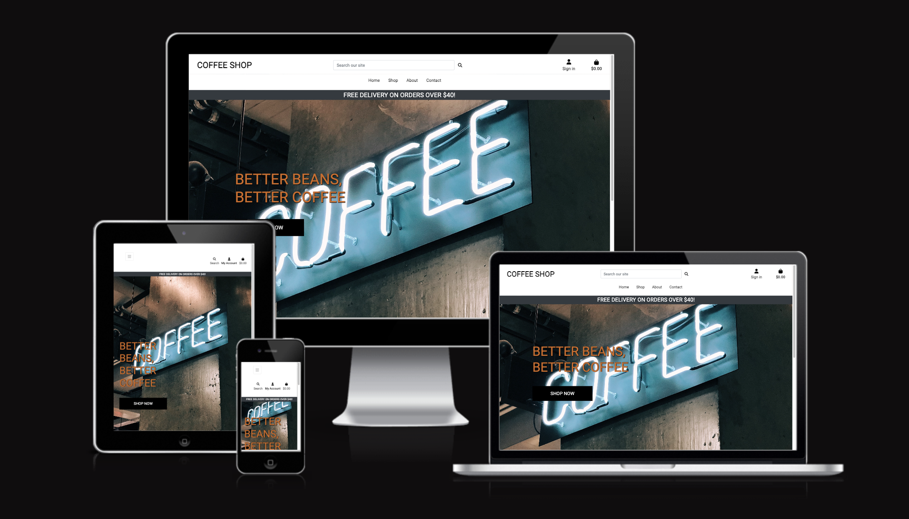

Coffee shop is a small family run coffee shop serving fresh coffee to people in London.
I have created this full-stack application using the Python, Django framework, Heroku PostgreSQL and front-end technologies, HTML, CSS, and Javascript.

My website can be found here...[Website](https://coffee-shop2023.herokuapp.com/)

---
## Table of Contents
1. [User Experience](#user-experience)
2. [Features](#project-features)
3. [Project Design](#project-design)
4. [Database Schema](#database-schema)
5. [Software & Libraries](#software--libraries)
6. [Instructions](#instructions)
7. [Testing](#testing)
8. [Deployment](#deployment-of-the-project)
9. [Credits](#credits)
---
## Goals 
The goal for this project was to allow users to register and confirm their email address, create a profile that would store user order information, order history, and favourited products.

Users also can browse filter and sort products by name and category.

As well as allow purchases of products themed around coffee, making reviews for products, aswell as contacting the store admin via mail. 
Visitors to the site may also subscribe to a newsletter. And receive an confirmation email after purchsing. 

The projects purpose is to enable customers to make purchases, register for an account, and review products while enjoying a nice user experience and user interface.

### Business Model 
I have chosen a traditional B2C (Business to Customer without middle person) application, which has a straightforward and user friendly interface. 
* The website handles selling of products directly to the end customer or the website user. 

## User Experience

User experience has been designed with a minimalistic, clean, and professional look. A light-colored background and bold dark colors for text as well as sharp images portray the purpose and goal of the e-commerce-site.
The visitors to Coffee Shop is most likely someone who enjoys making nice coffee at home. Who enjoys a nice espresso, or a pour over coffee from whole beans. A visitor to Coffee shop is also someone who most likely enjoys reading about coffee.

## Agile Development 
The plan for this project was carried out using the Agile Methodology in github. User Stories were created using issues on git hub. Each user story explicitly explains the purpose of the issues. They are prioritised using gitHub labels with different colors.
Each story was assigned a classification of Must-Have, Should-Have, Could-Have or Won't Have.
Some tasks were completed quicker than others but overall every thing went good. With the project being completed ahead of schedule. 

Here is a list of my User Stories...
* 1. As a site user i can view a list of products so that i can select some to purchase.
* 2. As a site user i can view individual products so that i can identify the description.
* 3. As a site user i can have a personal account so that i can view my profile.
* 4. As a site user i can easily login or logout so that i can access my account information.
* 5. As a site user i can have a personalized user profile so that i can view my order history.
* 6. As a site user i can recover my password if i forget it so that i can recover access to my account.
* 7. As a site user i can get an email after registering so that i know that my registration was successful.
* 8. As a site user i can see product reviews so that i can see which product is the most popular.
* 9. As a site user i can add items to my cart so that i can purchase them later.
* 10. As a site user i can view a specific category so that i can quickly find the product iam looking for.
* 11. As a site user i can search for products so that i can easily find what iam looking for.
* 12. As a site user i can delete an item from my cart so that i can change product to buy.
* 13. As a site user i can edit the amount of products in the shopping bag so that its easy to edit.
* 14. As a site user i can view my selected items in the bag so that i know what i am going to purchase.
* 15. As a site user i can enter my payment information easily so that i can checkout quickly.
* 16. As a site user i can view a order confirmation after purchase so that i know that my order went through.
* 17. As a site owner i can provide a contact form so that users can provide feedback or request products.
* 18. As a site owner i can have my customers signing up for a newsletter so that they can receive a emails about site news.
* 19. As a site admin i can add products so that i can update my inventory.
* 20. As a admin i can edit my products so that i can update them in the future.
* 21. As a admin i can be able to delete products so that i can remove old products.
* 22. As a site user i can be able to see the stores adress so that i can visit them.
* 23. As a site user i can read about the company so that i can get familiar with the company.
### Future implementation / Won't have
* 24. As a site user i can add products to a wishlist so that i can come back later and purchase them.
* 25. As a site user i can add a coupon code so that i can get a discount on my order.
* 26. As a site user i can buy a voucher so that it can be used to purchase on the site. 
* 27. As a site user i can learn the terms and conditions so that i can understand obligations and responsibilities.
* 28. As a site user i can find answers general questions so that i don't have to contact the site owner.

## Project Design 

### Colour Scheme 

* The idea for the site is minimalistic and clean, the project is partly inspired by Code Institutes "Boutique Ado" with some finishing styles that i've added. 

### Wireframes 
I took a lot of inspiration from Code Institutes Boutique Ado walktrough project. 
Homepage Mockup:
> Home page
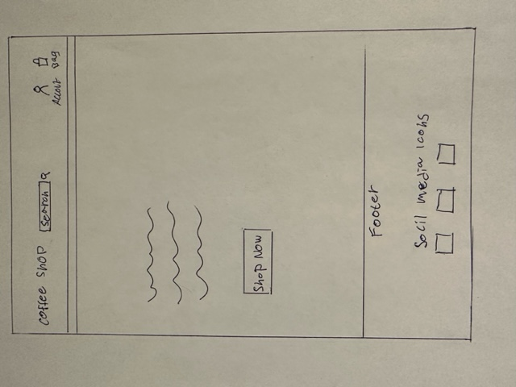
> All products page 
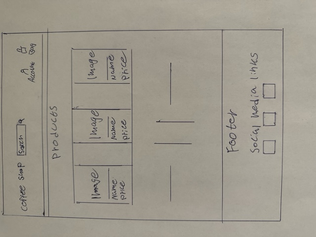

### Fonts 
Google Fonts has been used to provide free fonts for commercial use. The fonts selected have been chosen for differing reasons whilst still complementing each other. 

### Database Schema 
The Database schema is as below: 
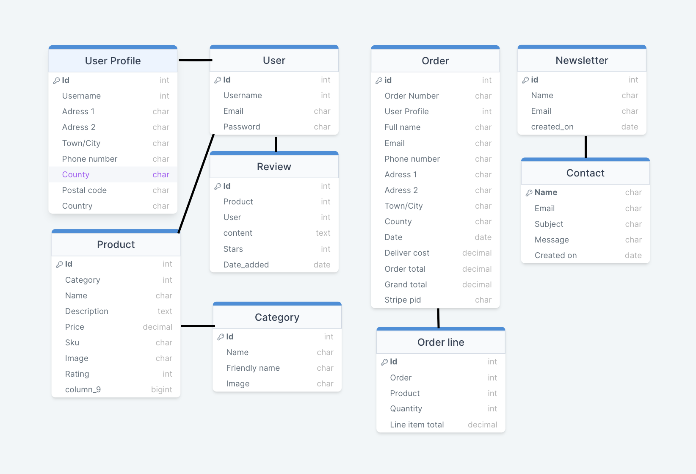

### Web Marketing Startegy 
Building on the insights gained as part of the Design Thinking phase. This project has the business model of Business to customer as the business is selling directly to the end user.
Market research was undertaken to decide on the appropriate marketing strategy to promote the Coffee shop brand. For social media marketing, Facebook is still the best option to promote brands to potential customers.
Users are encouraged to signup for newsletters, discounts and information about the products sold. The signup form is available on the websites footer. Allowing the website admin to send marketing emails through the platform.
> Product page mockup: 
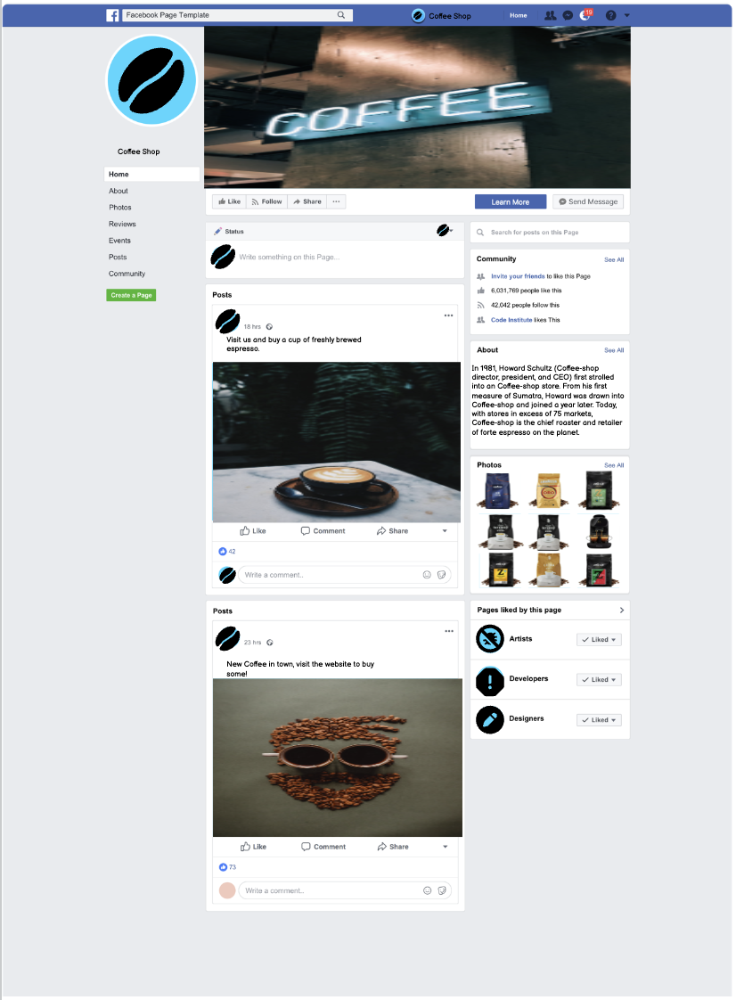

#### Search Engine Optimisation (SEO)
SEO is key to driving traffic from a browser search like Google to the website. To help improve the search engine ranking I ensured each web page has it's own title, and the site carries meta tags for a description and keywords which encapsulate the general content and focus of this B2C site.

#### Sitemap.xml / Robots.txt 
I have created a sitemap.xml and robot.txt to help search engines locate my website. And to keep the website safe.

#### Sitemap Google Registration
To ensure that the Google engine will check the website sitemap file I have registered the url on the Google Search Console.

#### Newsletter 
To allow the business to communicate with their customers to promote products and events through digital marketing, i have created a newsletter (One of three original models). The newsletter can be found at the bottom of the site, in the footer. Once the emial address is submitted a success message is presented to notify that the user is signed up. If by chance the user trys to sign up agian, the user is notifyied that their emial is already signed up.

#### Coffee shop location 
I have used Google Maps within an iframe inside the footer to promote the physical store location to show customers how they can physicaly experience the businesses coffee.

#### Facebook Page 
To increase traffic to the website, a facebook page has been built that will display information about the products and business.

## Project Features 

### Navbar
* I have used a Bootstrap 4 fixed navbar that remains on all pages. Its easy to navigate with a clear font and design. While collapsing to mobile view it changes to a burger menu. 
* The navbar includes a shop dropdown menu where you can selelct a specific category to browse through. 
aswell as a about page, and contact page. 
* To the right in the navbar is a dropdown meny for users to register/login and logout. Aswell as a big icon to enter the shooping bag. 
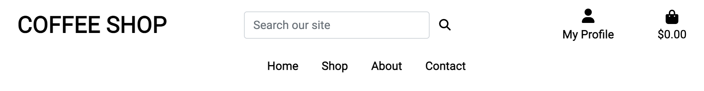

### Homepage 
* the homepage has several features, a nice background image with a button that is linked to the products page, containing all the products. Its easy for the user to access the products directly after opening th website. 

### Footer 
* The footer offers a nice dark colour to distinguishing the top from the bottom. The footer enables quick access to key information to improve the users journey on the website. It also includes the businesses socials.
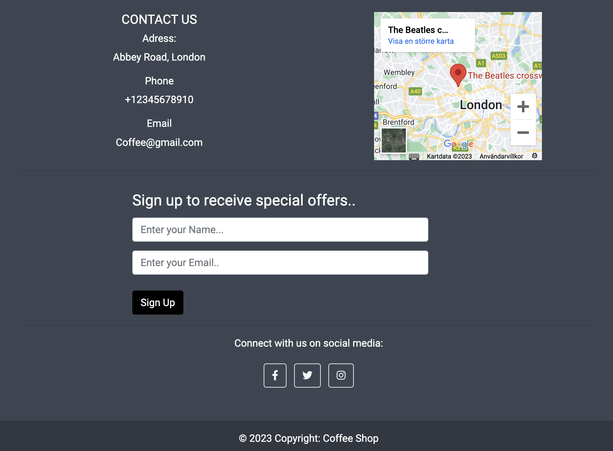

### Products & Customer reviews 
* Using a Bootstrap grid, the products are set out in rows with each product aligned to a card. 
Each card provides brief info on the product, and the user is able to find out more buy clicking on th eproduct image. 
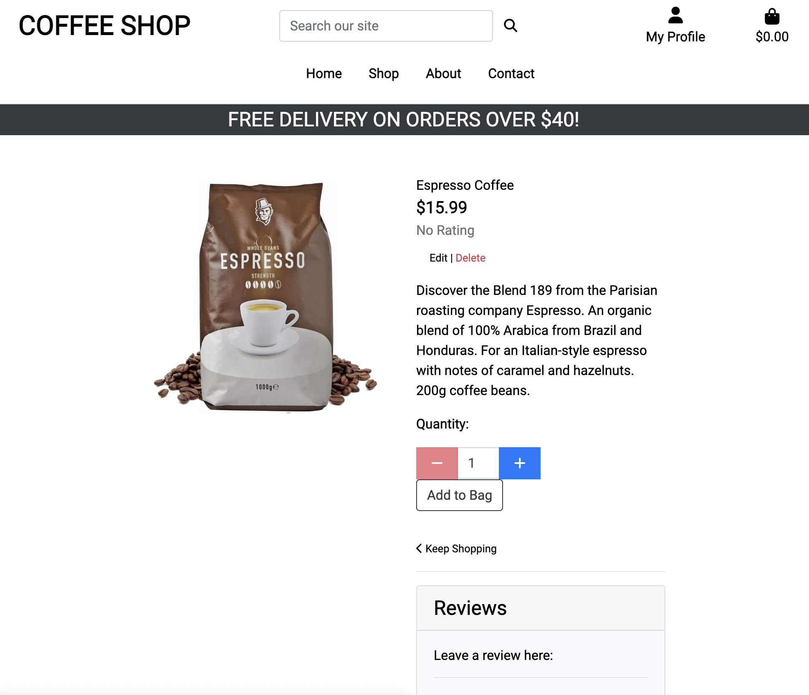
* Clicking through provides more information on the specific product with options to add the item to their bag or update quantity. This page also promotes feedback from users through Customer Reviews. Only users who are registered can leave a review so there is a handy link to encourage this feature. Reviews are published immediately to provide a feeling of success to the user. The business assess reviews regularly to ensure there is nothing inflammatory - at which point they could be deleted through Django Admin. (The Reviews feature is the second of the three oginal models).
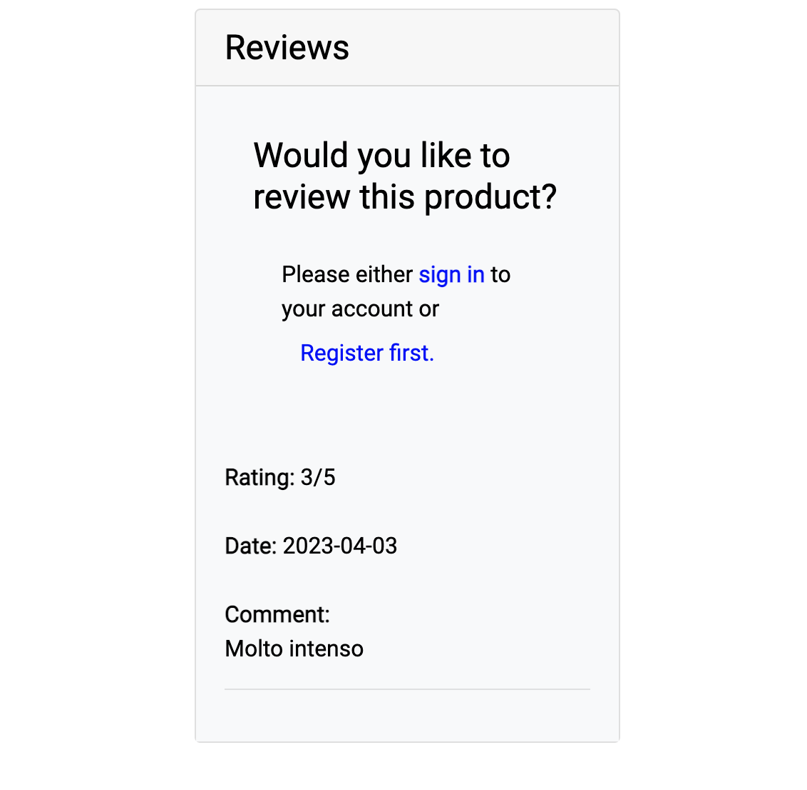

### Shopping Bag
The bag page provides an overview of all of the items added by the user. The information aims to confirm what the user has selected with a table of information about the product and a supporting image. The price of all items is calculated and provided as a 'subtotal' with the delivery charge if the price is not over 40 dollars. Users can change quantity of a product or remove a product from the shopping bag, before proceeding to checkout. Users also have the option to keep shooping via a button located at the bottom. 
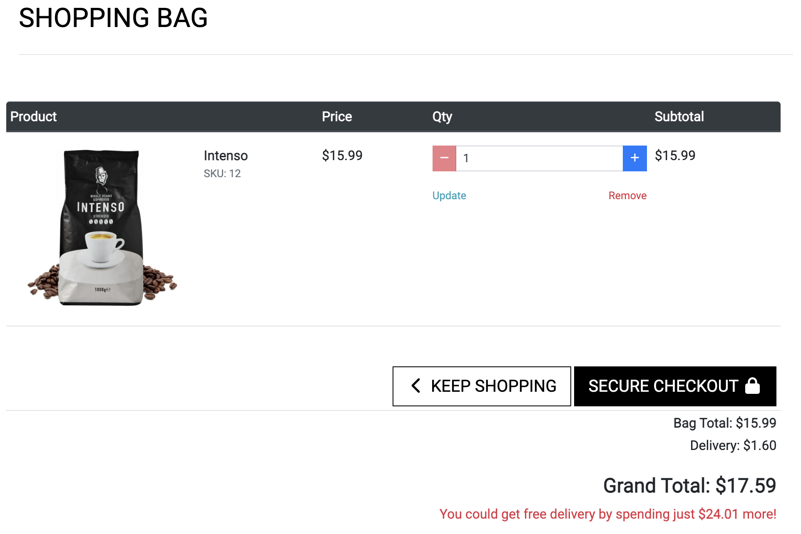

### Checkout 
This page enables the user to complete their transaction. It is split in to two sections with delivery and billing on the left side and an overview of the items that are about to be purchased on the right. Here stripe have been implemented to manage transactions and collect payments. The test purchases have been enabled using the following card details. 
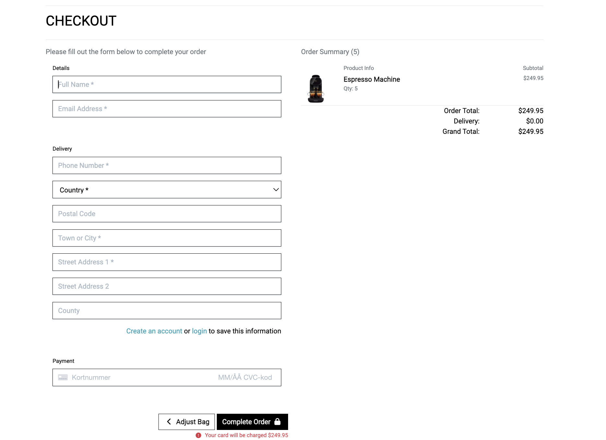

When completing a transaction, users are automatically navigated to the checkout success page. Which provides a confirmation. The confirmation is also emailed to the user. 
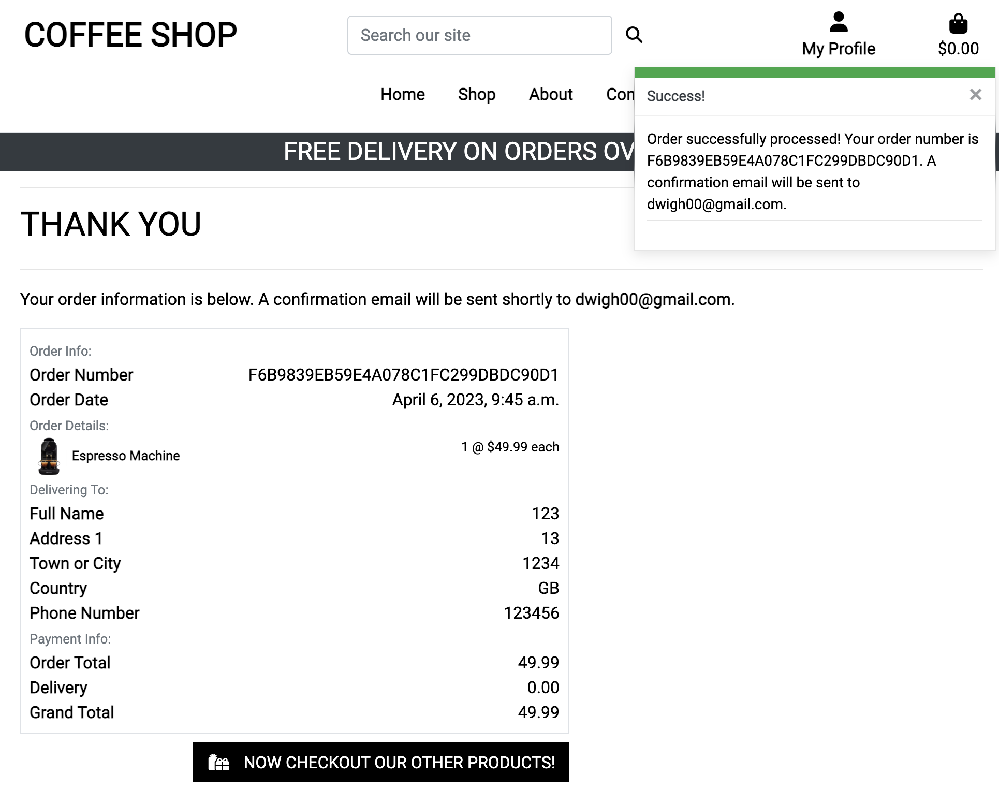

### User Profile 
Accessed through the 'My Account' link in the navbar, a registered and signed-in user can update their saved delivery details and view order history. Each transaction is a row with a table. The 'Order Number' can be clicked to open the order confirmation page.
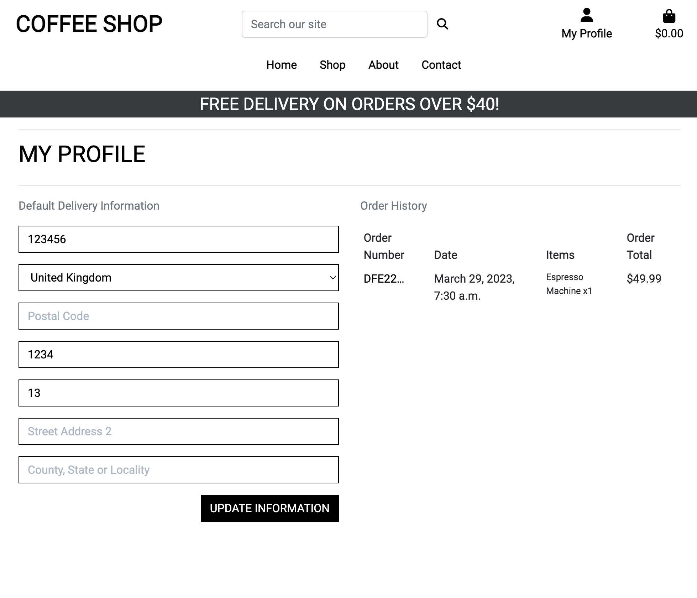

### Contact Page 
Users can contact the business via a form that can be navigated to via the link in the navbar. A short and simple form can be completed. For the user to leave their concerns. When a user submits the form a success message is shown at the top. 
(One of three original models)
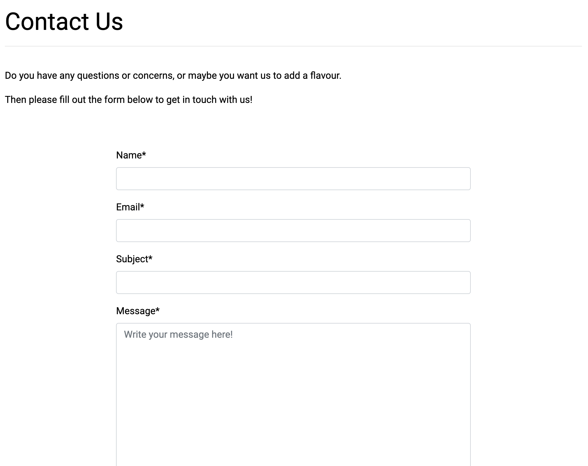

### About Page 
This page consists of the background of the company, when the owner traveled to Italy and traveld back to the UK later with some coffee. 
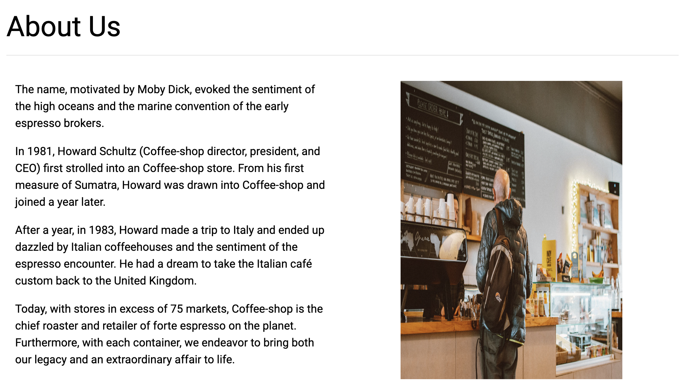

### Admin - Product Management
This feature is enabled for super users only.
With this role based permission setting you can perform CRUD (Create, Review, Update and Delete) products from either the front or back end. The front end product management incorporates Bootstrap and Crispy to present clean forms to either Add, Edit or Delete a product. Super users can review a product within the Product Details page - which when signed-in as a super user presents to links to either 'Edit' or 'Delete' and item. Otherwise this user type can add a product through the 'Account' drop-down nav menu, and selecting 'Add Products'. 
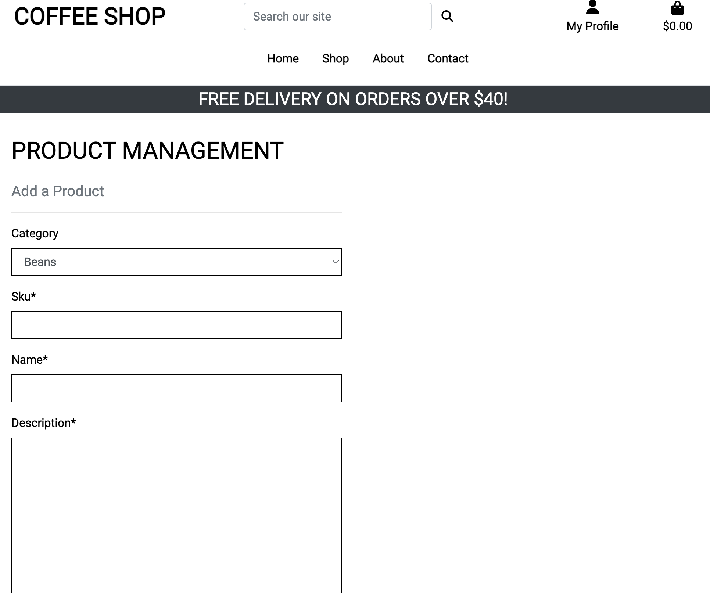

### Log in/Log out 
The login page is consist of a form wher ethe user has to enter either username or email and then password. When signed in the user gets a success message.
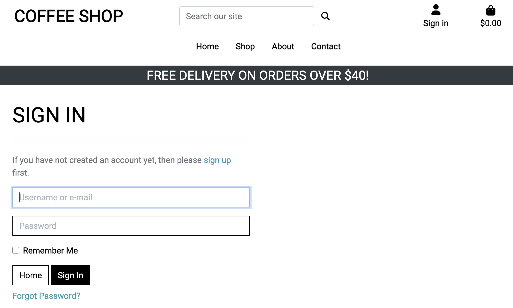
When logging out the user is shown a log out button on a new page with a question to definetly sign out. And when signed out the user is redirected to the home page and gets an success message. 
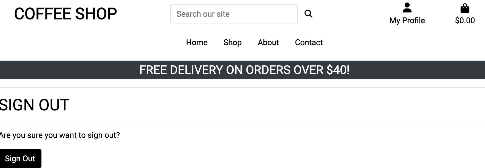

### Reset Password
Users can rest their password if they have an account by entering their email address that is connected to their profile account. Once this is done users will receive confirmation that an email has been sent to them in order to reset their password on their account securely. If users change their mind they can select the 'Back to Login' option.

### Webhooks 
When a order is successfully completed its is shown in the webhooks section on stripe.com. 
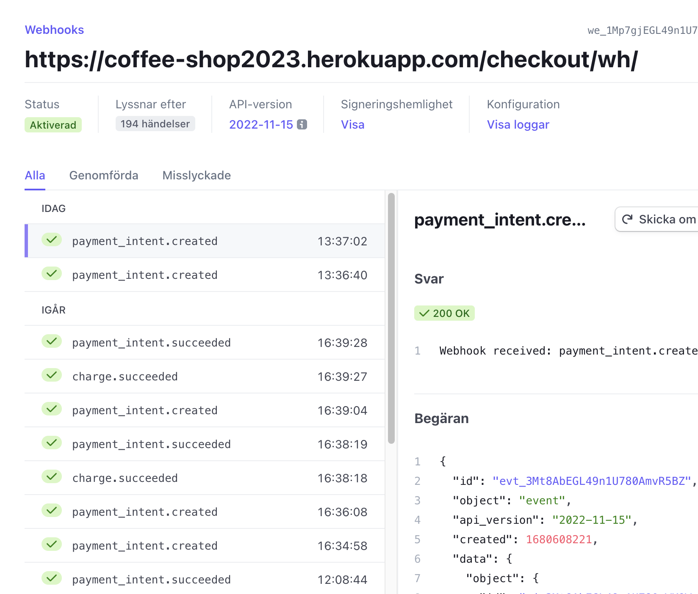

### Toasts 
* I have included toast messages that display in the top right corner anytime the user has done something on the site. Either a green success essage or red error message.
* 403/404/500 
If any links are broken or the user types a faulty adress a 403/404 and 500 page is being displayed.
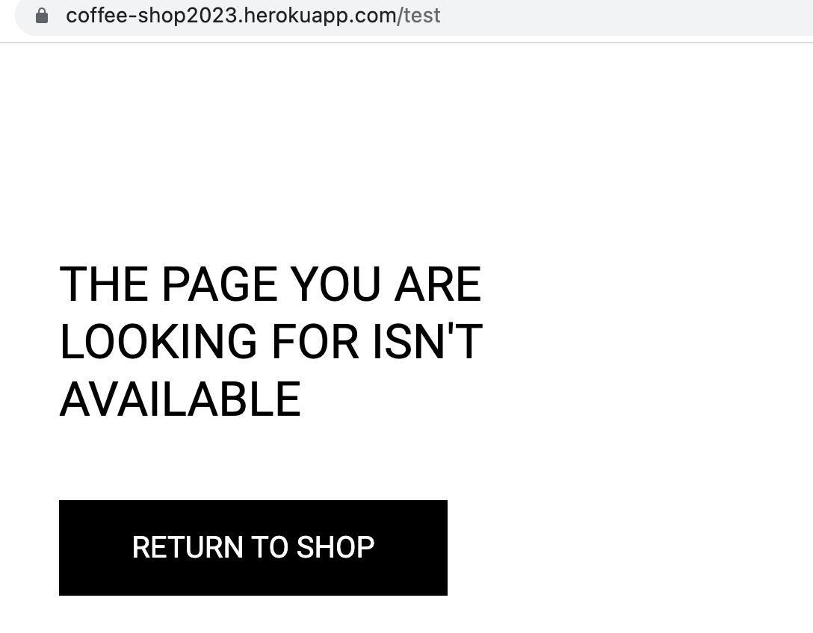

### Technologies 
Languages used:
* HTML
* CSS
* Javascript
* Python/Django 
#### Software & Libraries
* [Gitpod](https://www.gitpod.io/) for IDE and Github as a hosting Repository. 
* [Django](https://www.djangoproject.com/) a python based framework. 
* [Bootstrap](https://getbootstrap.com/docs/4.6/getting-started/introduction/#starter-template), was used to build responsive web pages. 
* [Font Awesome](https://fontawesome.com/), source of all site icons.
* [Cloudinary](https://cloudinary.com/), to store images and static files. 
* [ElephantSQL](https://www.elephantsql.com/), databse through Heroku.
* [Crispy Forms](https://django-crispy-forms.readthedocs.io/en/latest/), rendering on forms.
* [Pillow](https://pypi.org/project/Pillow/), to support image processing.
* [Balsamiq](https://balsamiq.com/), to build web marketing mockup page.
* [Google Developer Tools](https://www.google.com/chrome/dev/), to build responsivness and identifying bugs. 
* [Heroku](https://www.heroku.com/platform), to host live website. 
* [Stripe](https://stripe.com/), used to receive payments.
* [Lighthouse](https://chrome.google.com/webstore/detail/lighthouse/blipmdconlkpinefehnmjammfjpmpbjk?hl=sv), to check quality of web pages.
* [Html validator](https://validator.w3.org/), validate html code. 
* [W3 CSS Validator](https://jigsaw.w3.org/css-validator/), validate css code. 
* [JSHint](https://jshint.com/), validate Javascript code.
* [PEP8CI](https://pep8ci.herokuapp.com/#), validate Python code. 

### Creating the Django app
* 1. Go to the Code Institute Gitpod Full Template. 
* 2. Click on Use This Template.
* 3. Once the template is available in your repository click on Gitpod
* 4. When the image for the template and the Gitpod are ready open a new 
terminal to start a new Django App
* 5. Install Django and gunicorn: pip3 install django gunicorn
* 6. Install supporting database libraries dj_database_url and psycopg2 library: pip3 install dj_database_url psycopg2
* 7. Create file for requirements: in the terminal window type pip freeze --local > requirements.txt
* 8. Create project: in the terminal window type django-admin startproject your_project_name
* 9. Create app: in the terminal window type python3 manage.py startapp your_app_name.
* 10. Add app to the list of installed apps in settings.py file: you_app_name
* 11. Migrate changes: in the terminal window type python3 manage.py migrate
* 12. Run the server to test if the app is installed, in the terminal "The install worked successfully! Congratulations!". 

### Gmail SMTP
* For this project i have used gmail smtp to send order confirmations and user contact emails in the deployed version. To use this configuration, copy and adapt the code below into your settings.py file.
    * if 'DEVELOPMENT' in os.environ:
        EMAIL_BACKEND = 'django.core.mail.backends.console.EmailBackend'
        DEFAULT_FROM_EMAIL = '(ADD YOUR EMAIL ADDRESS)@gmail.com'
    * else:
        EMAIL_BACKEND = 'django.core.mail.backends.smtp.EmailBackend'
        EMAIL_USE_TLS = True
        EMAIL_PORT = 587
        EMAIL_HOST = 'smtp.gmail.com'
        EMAIL_HOST_USER =  os.environ.get('EMAIL_HOST_USER')
        EMAIL_HOST_PASSWORD = os.environ.get('EMAIL_HOST_PASS')
        DEFAULT_FROM_EMAIL = os.environ.get('EMAIL_HOST_USER')

### ElephantSQL Database
* The app also uses ElephantSQL to host the database.
The steps to use ElephantSQl are as follows..

* 1. Log in to ElephantSQL or create an account for free.
* 2. Click on create a new instance.
* 3. Set up your plan, give the 'plan' the desired name, select Tiny Turtle(free) plan and leave tags blank.
* 4. Select the region, and select the nearest to your location.
* 5. Click review, and if everything is ok, click on create instance down at the bottom.
* 6. From the instances section click on instance with the name that was just created.
* 7. Get the databse URL from the instance details page and copy it, this will be inserted in the Heroku Config vars, as DATABASE_URL. 
### Stripe 
Stripe is used to handle the checkout process when a payment is made. To use stripe you have to have a account. 
* 1.  To setup payments follow this
[tutorial](https://stripe.com/docs/payments/accept-a-payment#web-collect-card-details).
#### Webhooks
* 1. To set up a webhook, sign into your stripe account and click 'Developers' located in the top.
* 2. Click on webhooks and the "add endpoint"
* 3. On the next page you will need to input the link to your heroku app followed by /checkout/wh/. It should look something like this:
> https://your-app-name.herokuapp.com/checkout/wh/
* 4. Then click '+ Select events' and check the 'Select all events' checkbox at the top before clicking 'Add events' at the bottom. Once this is done finish the form by clicking 'Add endpoint'.
* 5. Your webhook is now created and you should see that it has generated a secret key. You will need this to add to your heroku config vars.
* 6. Head over to your app in heroku and navigate to the config vars section under settings. You will need the secret key you just generated for your webhook, in addition to your Publishable key and secret key that you can find in the API keys section back in stripe.
* 7. Add these values under these keys:
    * STRIPE_PUBLIC_KEY = 'insert your stripe publishable key'
    * STRIPE_SECRET_KEY = 'insert your secret key'
    * STRIPE_WH_SECRET = 'insert your webhooks secret key'
* 8. Finally, back in your setting.py file in django, insert the following near the bottom of the file:
    * STRIPE_PUBLIC_KEY = os.getenv('STRIPE_PUBLIC_KEY', '')
    * STRIPE_SECRET_KEY = os.getenv('STRIPE_SECRET_KEY', '')
    * STRIPE_WH_SECRET = os.getenv('STRIPE_WH_SECRET', '')
### Deployment of the project 
The site was deployed by following the these steps. 
* 1. Log in to Heroku or create an account
* 2. On the main page click the button labelled New in the top right corner and from the drop-down menu select Create New App (You must enter a unique app name).
* 3. Next select your region (closest to you).
* 4. Click on the Create App button.
* 5. Click in resources and select Heroku Postgres database.
* 6. Click Reveal Config Vars and add:
    * CLOUDINARY_URL.
    * DATABASE_URL.
    * EMAIL_HOST_PASS.
    * EMAIL_HOST_USER.
    * SECRET_KEY.
    * STRIPE_PUBLIC_KEY.
    * STRIPE_SECRET_KEY.
    * STRIPE_WH_SECRET.
* 7. Next scroll to the top of the page and choose the Deploy tab.
* 8. Select Github as the deployment method. 
* 9. Confirm you want to connect to GitHub
* 10. Search for the repository name and click the connect button
* 11. Scroll to the bottom of the deploy page and select the preferred deployment type.
* 12. Click Enable Automatic Deploys for automatic deployment when you push updates to Github.

### Final Deployment 
* 1. Create a Procfile "web: gunicorn your_project_name.wsgi"
* 2. When development is complete change the debug setting to: DEBUG = False in settings.py. 
* 3. In Heroku settings config vars delete the record for DISABLE_COLLECTSTATIC.
### Local Deployment 
* Requirements: 
    * An IDE, such as Visual Studio Code
    * Python3 
    * Pip
    * Git
    * Postgres database set up
    * Cloudinary, to host static files.
#### Instructions
* 1. Clone the repository with: 
git clone hhttps://github.com/Dominikwigh/coffee-shop
* 2. Open your IDE and chose the base directory. 
* 3. Run the programs virtual environment with:
python3 -m .venv venv
The site can also be run without setting up a virtual environment, please see the python documentation here:
* 4. Run the virtual environment with:
.venv\Scripts\activate
* 5. Install project requirements with:
pip3 -r requirements.txt.
* 6. Set up the necessary environment variables in your IDE. Personally i have a env.py file that i have imported into settings.py. So i it would be a good idea for you to do the same. The necessary variables are as follows: 
    * CLOUDINARY_URL.
    * DATABASE_URL.
    * EMAIL_HOST_PASS.
    * EMAIL_HOST_USER.
    * SECRET_KEY.
    * STRIPE_PUBLIC_KEY.
    * STRIPE_SECRET_KEY.
    * STRIPE_WH_SECRET.
some variables might not be necessary based on your setup, so the settings.py file needs to be modified accordingly. ALLOWED_HOST has to be in settings.py. 
* 7. Run the migrate command to create the data tables with:
python manage.py migrate 
* 8. Create a superuser with username and password:
python manage.py createsuperuser.
* 9. Run the local server:
python manage.py runserver
* 10. The site should be run and be accessible.  

### Forking The Project 
* Follow these steps to fork this project. 
* 1. Open Github.
* 2. find the "fork" button at the top right of the page. 
* 3. Once you clik the button the fork will be in your repository. 

### Cloning the project 
* Follow these steps to clone this project. 
* 1. Open GitHub.
* 2. You will be provided with three options to choose from, HTTPS, SSH or GitHub CLI, click the clipboard icon in order to copy the URL.
* 3. Once you click the button the fork will be in your repository.
* 4. Open a new terminal.
* 5. Change the current working directory to the location that you want the cloned directory.
* 6. Type "git clone" and paste the URL copied in step 3.
* 7. Press "Enter" and the project is cloned.

## Testing
Testing can be found here..
[TESTING.md](TESTING.md)

## Credits 

### Code 
* In general the coding and testing has relied on the Code Institutes walkthrough project "Boutique Ado", with customisations to bring in information about the business and how to contact coffeeshop. Additionally, users can add product reviews and signup for a newsletter. 
* The [Django documentation](https://docs.djangoproject.com/en/4.0/) was a key role for trouble shooting.
* [Stack Overflow](https://stackoverflow.com/) for finding solutions and research.
* [W3Schools](https://www.w3schools.com/) for research on different syntaxes.
* [Newsletter in django](https://dev.to/shubhamkshatriya25/how-to-build-a-email-newsletter-subscriber-in-django-j2p) was used as a reference to build the newsletter functionality.
* To build the review functionality i used [Product reviews](https://www.youtube.com/watch?v=Y5vvGQyHtpM) as an reference.
* The code for the footer was taken from [Mbbootstrap](https://mdbootstrap.com/docs/standard/navigation/footer/examples-and-customization/) with my own modifications.

#### Images
* Product images were taken from [kaffekapslen](https://www.kaffekapslen.se/) with permission.
* Favicon was taken from [Uxwing](https://uxwing.com/coffee-icon/)
* The background image and about page image was taken from [Pixels](https://www.pexels.com/)

## Acknowledgements
* Big thank you to my mentor Rory Patrick. 
* The slack community.
* Tutor support.
* My family for taking the time to visit my site and give me feedback.

### Notes
* To test buying a product(s) please use the following card payment details.
    * Card Number: 4242 4242 4242 4242
    * Expiry date: 04/24 (any future month/year)
    * 3-digit CVC code: 242 (any 3-digit code)
    * 5-digit ZIP code: 42424 (any ZIP code)

<a href="#top">Back to top</a>